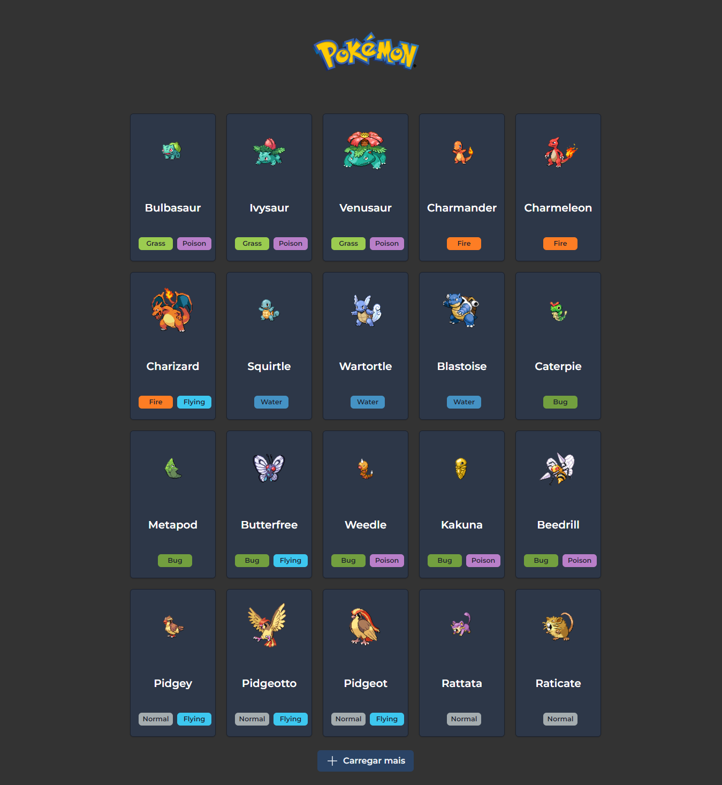

# Pokédex-io

Projeto front-end para construção de uma pokédex. Objetivo do projeto é desenvolver habilidades em; 

- React;

- Typescript;

- Consumindo um api real;

- Estilização com TailwindCSS;

## 🛠 Tecnologias

- React
- Typescript
- TailwindCSS
- Chakra-ui

